# Project 1: 

## Sales results for a reseller of luxury automobiles based in São Paulo.
 
### Business Problem: 

- The C-Board is evaluating whether or not to continue selling Jaguar-branded cars and would like to know how Jaguar car sales have evolved by year and by state.

### Tools: 

- Microsoft Power BI

- Libre Office Calc 

### Data source:

 - An Excel file with data collected from the company's sales system and CRM, with the following columns:

| Column      | Description         |
| ----------- | -----------         |
| Invoice Date | Invoice issue date |
| Manufacturer	 | Vehicle manufacturer |
| State | State where the sale took place |
| Sales Price |  Vehicle sales price|
| Purcharse Price | The price paid for the company by the vehicles|
| Total Discount| Total discount provided on the sale price |
| Cost Delivery | Cost of delivering the vehicle to the owner |
| Labor Costs | Labor Cost (sales personnel, mechanic, etc...)|
| Customer Name | Name of the customer who purchased the vehicle |
| Model | Vehicle model |
| Color | Vehicle color |
| Year | Vehicle manufacturing year |

### Dashboard: 

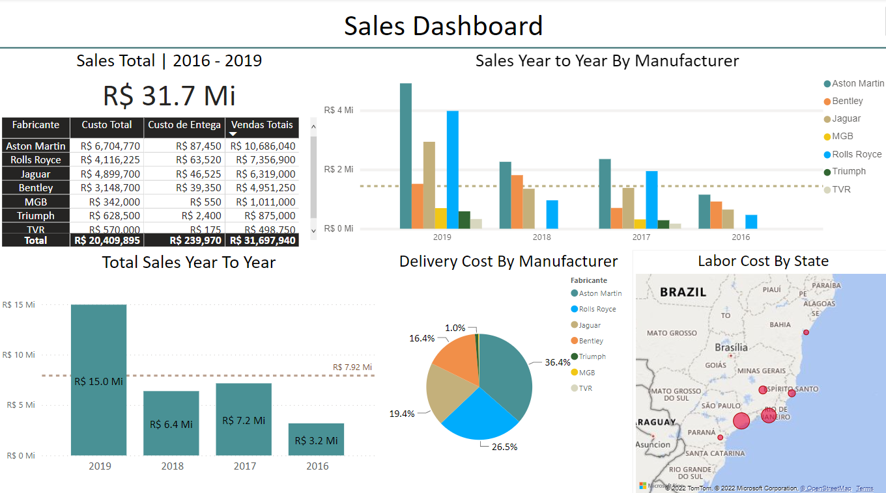

# Project 2:

## Web Scraping and Data Wrangling with Python

### Goal of Project:

- Demonstrates how to prepare raw data acquired from the web that needs Data Wrangling. 

- Focus on acquiring and preparing steps of Data Science workflow.

### Tools:

- Jupyter Notebook

- Python libraries: pandas and matplotlib

### Data source:

- [Wikipedia:Fundraising statistics](https://en.wikipedia.org/wiki/Wikipedia:Fundraising_statistics)

### Workflow:

#### Step 1: Acquire

 - Importing libraries

`import pandas as pd`

`import matplotlib.pyplot as plt`

`%matplotlib inline`

- Retrieving and reading the data

`url = 'https://en.wikipedia.org/wiki/Wikipedia:Fundraising_statistics'`

`table = pd.read_html(url)`

`data = table [0]`

`data.head()`

#### Step 2: Prepare

- Looking for null (missing) values

`data.isna().any()`
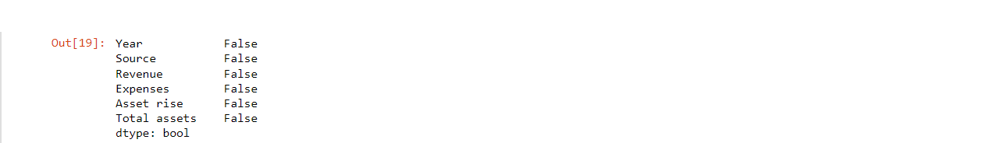

- Checking the data types

`data.dtypes`

- Deleting the Source Column

Since 'Source' column has no values for futher analysis it was deleted.

`del data['Source']`

`data.head()`

- Converting 'Year' column to numeric

All the strings in years are formatted: 'YYYY/YYYY';  we want to get the last year as a string, then convert that to numeric.

`data ['Year'] = data ['Year'].str[-4:]`

`data.head()`

`data ['Year'] = pd.to_numeric (data ['Year'])`

`data.dtypes`

- Setting 'Year' to index

`data.set_index('Year', inplace=True)`

`data.sort_index(inplace=True)`

`data`

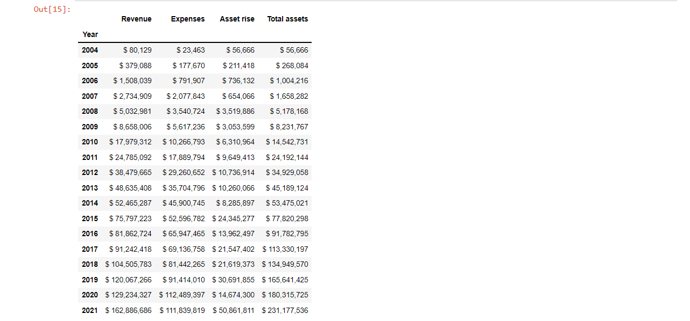

- Converting the remaining columns to numeric

`data ['Revenue'] = pd.to_numeric(data ['Revenue'].str[2:].str.replace(',', ''))`

`data ['Expenses'] = pd.to_numeric(data ['Expenses'].str[2:].str.replace(',', ''))`

`data ['Asset rise'] = pd.to_numeric(data ['Asset rise'].str[2:].str.replace(',', ''))`

`data ['Total assets'] = pd.to_numeric(data ['Total assets'].str[2:].str.replace(',', ''))`

`data.dtypes`

- Visualizing data to investigate quality

`data [['Revenue', 'Expenses', 'Total assets']].plot()`

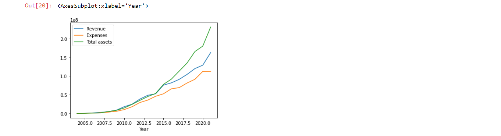

`data ['Asset rise'].plot()`

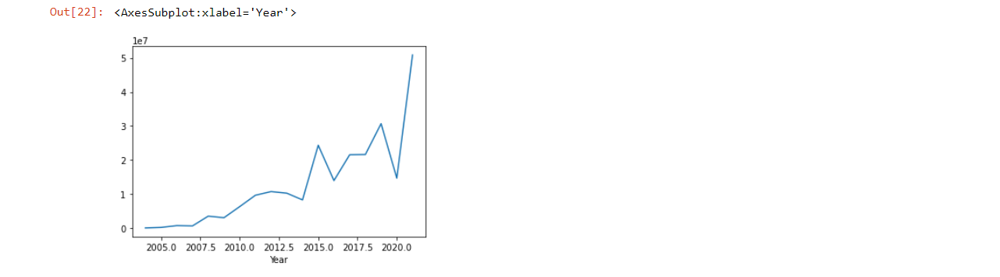

# Project 3:

## Analyzing data using Word Cloud

### Goal of Project:

- Get insights from Wikipedia webpage related to Data Science. Discover more related concepts by doing text mining, extract keywords from it, and then visualize the result.

### Tools and Resources:

- Jupyter Notebook

- Python libraries: 
1. requests 
2. rake
3. matplotlib
4. wordcloud

### Data source:

[Wikipedia Webpage: Data Science](https://en.wikipedia.org/wiki/Data_science)

### Workflow:

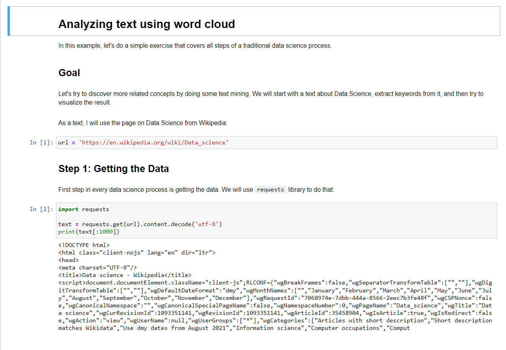
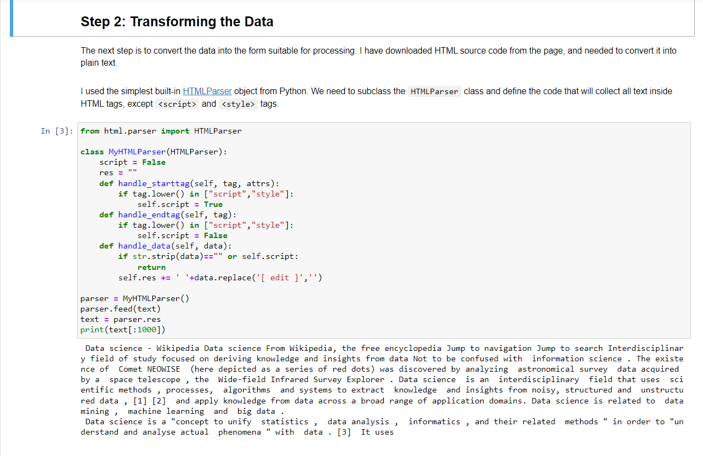
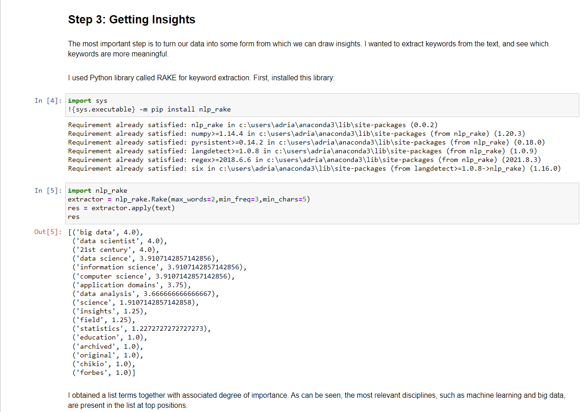
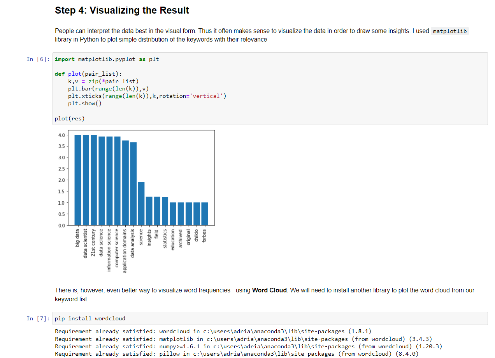
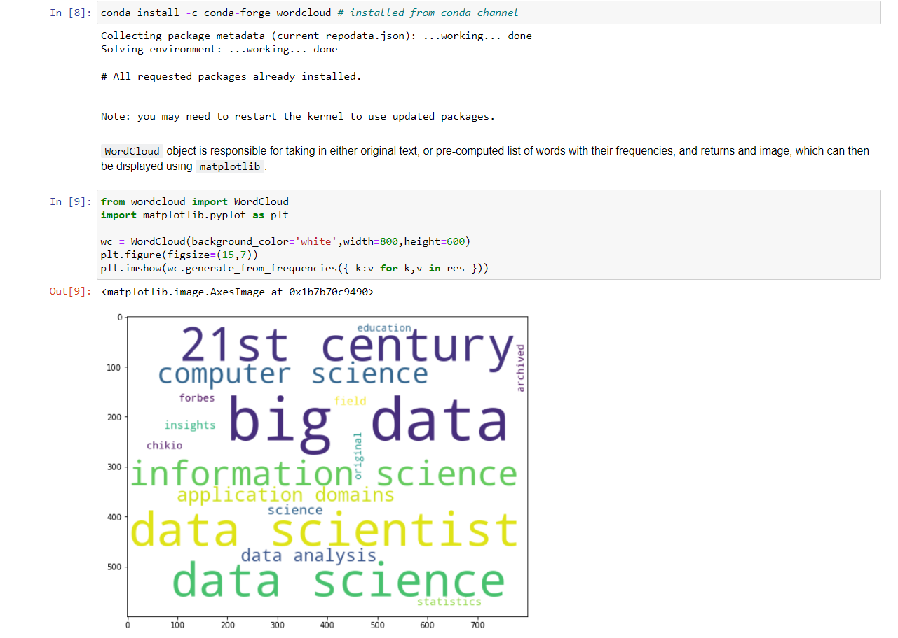
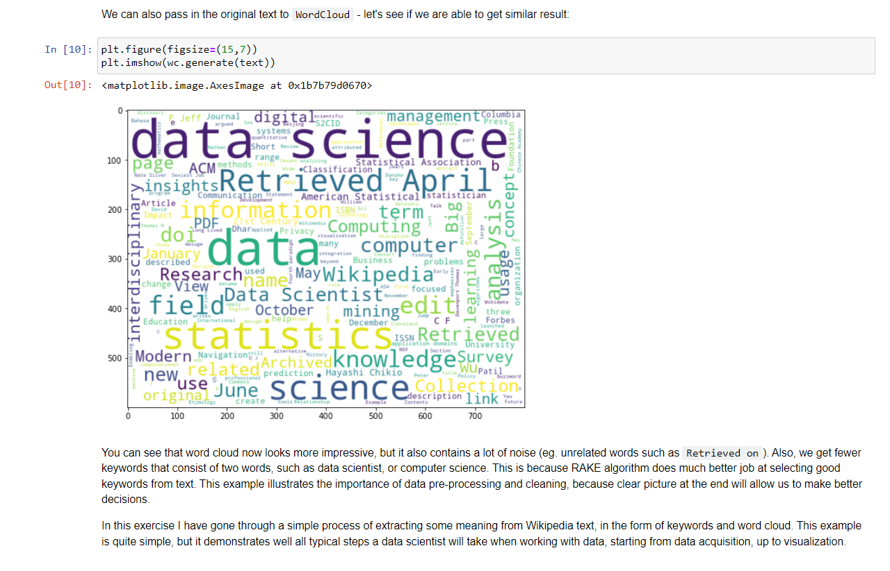
