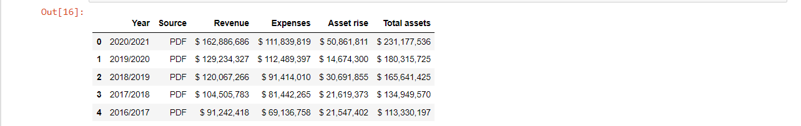

# Project 1: 

## Sales results for a reseller of luxury automobiles based in São Paulo.
 
### Business Problem: 

- The C-Board is evaluating whether or not to continue selling Jaguar-branded cars and would like to know how Jaguar car sales have evolved by year and by state.

### Tools: 

- Microsoft Power BI

- Libre Office Calc 

### Data source:

 - An Excel file with data collected from the company's sales and CRM system, with the following columns:

| Column      | Description         |
| ----------- | -----------         |
| Invoice Date | Invoice issue date |
| Manufaturer | Vehicle manufacturer |
| State | State where the sale took place |
| Sales Price |  Vehicle sales price|
| Pucharse Price | The price paid for the company by the vehicles|
| Total Discount| Total discount provided on the sale price |
| Cost Delivery | Cost of delivering the vehicle to the owner |
| Labor Costs | Labor Cost (sales personnel, mechanic, etc...)|
| Customer Name | Name of the customer who purchased the vehicle |
| Model | Vehicle model |
| Color | Vehicle color |
| Year | Vehicle manufacturing year |

### Dashboard: 

# Project 2:

## Acquire and Prepare Data from Web

 ### Goal of Project:

- Demonstrates how to prepare raw data acquired from the web that needs Data Wrangling. 

- Focus on acquiring and preparing steps of Data Science workflow.

### Tools:

- Jupyter Notebook

- Python libraries: pandas and matplotlib

### Data source:

- [Wikipedia:Fundraising statistics](https://en.wikipedia.org/wiki/Wikipedia:Fundraising_statistics)

### Workflow:

#### Step 1: Acquire

 - Import libraries

`import pandas as pd`

`import matplotlib.pyplot as plt`

`%matplotlib inline`

- Retrieving and read the data

`url = 'https://en.wikipedia.org/wiki/Wikipedia:Fundraising_statistics'`

`table = pd.read_html(url)`

`data = table [0]`

`data.head()`

#### Step 2: Prepare

- Check for null (missing) values

- Checking the data types

